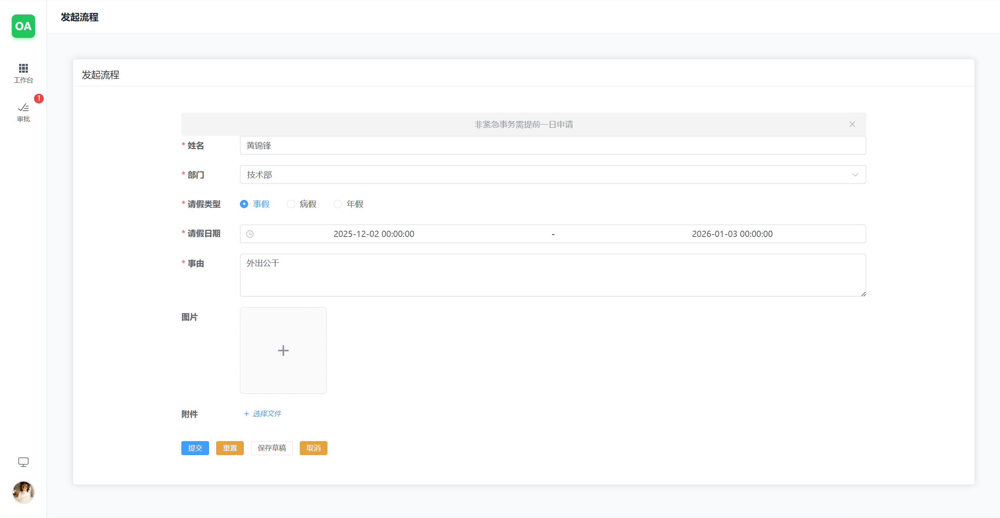
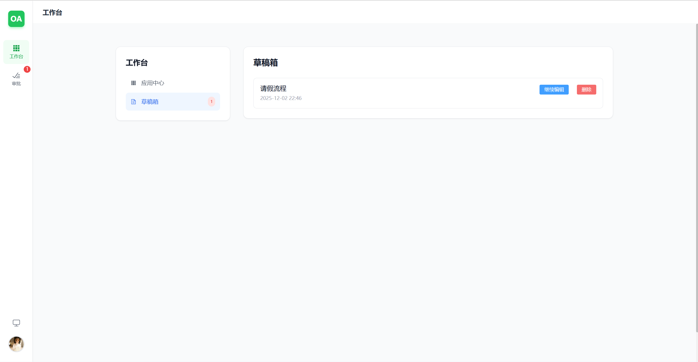
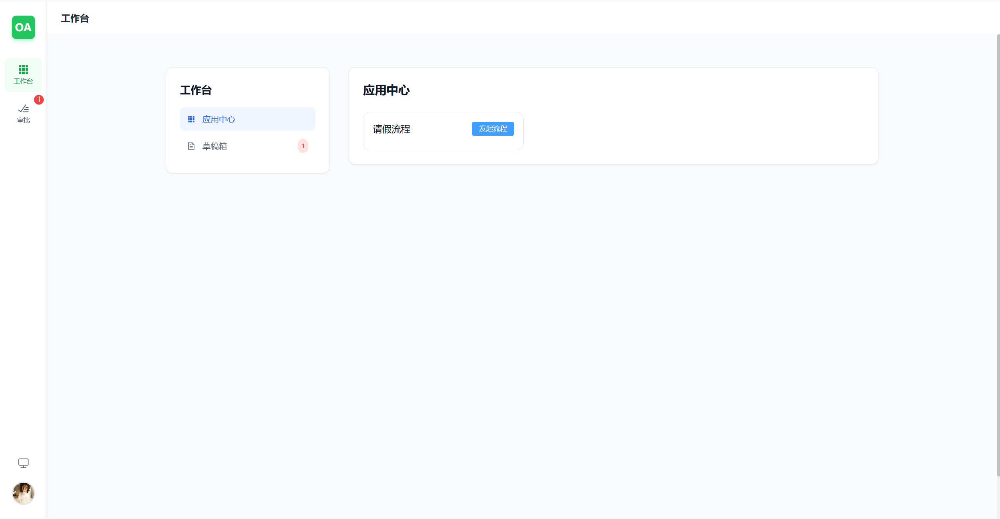
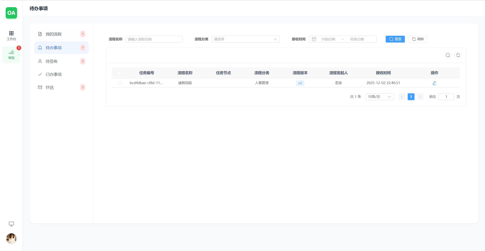
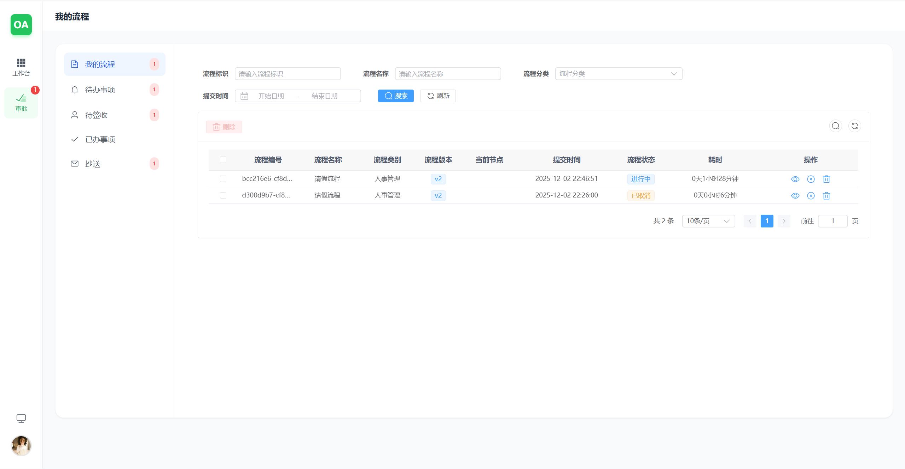
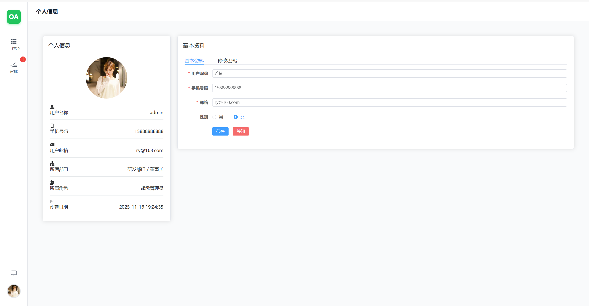
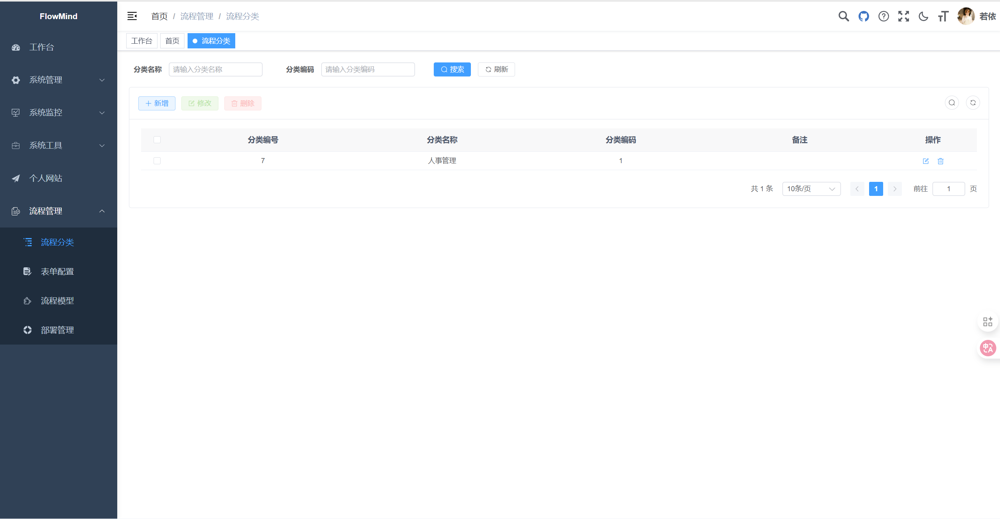
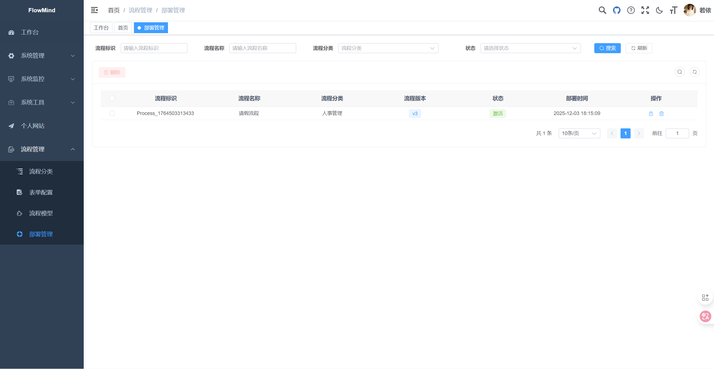
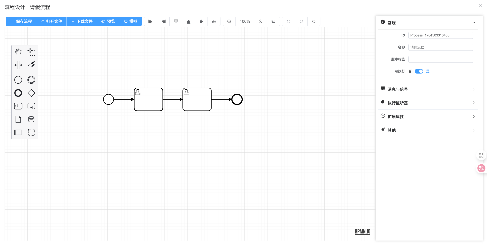
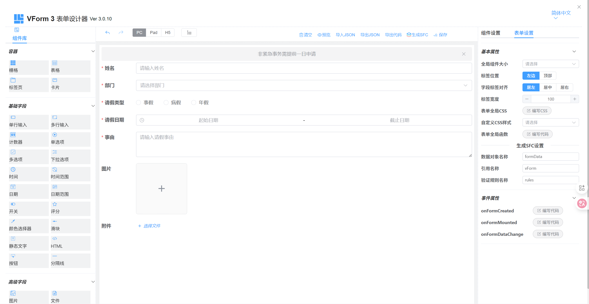

<p align="center">
	
</p>
<h1 align="center" style="margin: 30px 0 30px; font-weight: bold;">FlowMind v1.0.0</h1>
<h4 align="center">基于 RuoYi-Cloud 的企业级工作流管理系统，新增审批中心和草稿箱功能</h4>
<p align="center">
	<a href="https://gitee.com/wish168/flowmind"></a>
	<a href="https://gitee.com/wish168/flowmind/blob/master/LICENSE"></a>
</p>

## 项目简介

FlowMind是基于RuoYi-Cloud的企业级工作流管理系统，在保留RuoYi-Cloud原有功能的基础上，新增了审批中心和草稿箱功能，为企业提供更完善的流程管理解决方案。

* 基于[RuoYi-Cloud](https://gitee.com/y_project/RuoYi-Cloud)框架进行扩展开发。
* 采用前后端分离架构，后端使用Spring Boot、Spring Cloud & Alibaba微服务架构，前端采用Vue3 + Element Plus + Vite。
* 注册中心、配置中心选型Nacos，权限认证使用Redis。
* 流量控制框架选型Sentinel，分布式事务选型Seata。
* 在RuoYi-Cloud原有功能基础上，新增了以下核心功能：
    * **审批中心**：提供统一的流程审批管理界面，支持待办任务、已办任务、待签任务、我的流程等全方位流程管理
    * **草稿箱**：支持流程草稿的保存、编辑和管理，用户可以随时保存未完成的流程申请，稍后继续编辑

## 项目结构

~~~
flowmind/
├── flowmind-ui           // 前端项目
├── flowmind-cloud        // 后端项目
│   ├── flowmind-gateway      // 网关模块
│   ├── flowmind-auth         // 认证中心
│   ├── flowmind-api          // 接口模块
│   │   └── flowmind-api-system                  // 系统接口
│   ├── flowmind-common       // 通用模块
│   │   └── flowmind-common-core                  // 核心模块
│   │   └── flowmind-common-datascope             // 权限范围
│   │   └── flowmind-common-datasource            // 多数据源
│   │   └── flowmind-common-log                   // 日志记录
│   │   └── flowmind-common-redis                 // 缓存服务
│   │   └── flowmind-common-security              // 安全模块
│   │   └── flowmind-common-swagger               // 系统接口
│   ├── flowmind-modules      // 业务模块
│   │   └── flowmind-system                       // 系统模块 
│   │   └── flowmind-gen                          // 代码生成
│   │   └── flowmind-job                          // 定时任务
│   │   └── flowmind-file                         // 文件服务
│   │   └── flowmind-flowable                     // 工作流模块
│   ├── flowmind-visual       // 图形化管理模块
│   │   └── flowmind-visual-monitor               // 监控中心
│   └── pom.xml                // 公共依赖
~~~

## 在线体验

演示地址：https://codebyggbond.dpdns.org/series/myprojects/FlowMind/  
文档地址：https://codebyggbond.dpdns.org/

测试账号：admin/123456

## 项目仓库

* 前端项目：[FlowMind-UI](https://github.com/Moonlight168/flowmind) - 基于Vue3 + Element Plus + Vite
* 后端项目：[FlowMind-Cloud](https://github.com/Moonlight168/flowmind) - 基于Spring Boot 3 + Spring Cloud Alibaba

## 主要功能

### RuoYi-Cloud原有功能

1. 用户管理：用户是系统操作者，该功能主要完成系统用户配置。
2. 部门管理：配置系统组织机构（公司、部门、小组），树结构展现支持数据权限。
3. 岗位管理：配置系统用户所属担任职务。
4. 菜单管理：配置系统菜单，操作权限，按钮权限标识等。
5. 角色管理：角色菜单权限分配、设置角色按机构进行数据范围权限划分。
6. 字典管理：对系统中经常使用的一些较为固定的数据进行维护。
7. 参数管理：对系统动态配置常用参数。
8. 通知公告：系统通知公告信息发布维护。
9. 操作日志：系统正常操作日志记录和查询；系统异常信息日志记录和查询。
10. 登录日志：系统登录日志记录查询包含登录异常。
11. 在线用户：当前系统中活跃用户状态监控。
12. 定时任务：在线（添加、修改、删除)任务调度包含执行结果日志。
13. 代码生成：前后端代码的生成（java、html、xml、sql）支持CRUD下载 。
14. 系统接口：根据业务代码自动生成相关的api接口文档。
15. 服务监控：监视当前系统CPU、内存、磁盘、堆栈等相关信息。
16. 在线构建器：拖动表单元素生成相应的HTML代码。
17. 连接池监视：监视当前系统数据库连接池状态，可进行分析SQL找出系统性能瓶颈。

### FlowMind新增功能

18. **审批中心**：
    * 待办任务：显示当前用户需要处理的任务列表
    * 已办任务：显示当前用户已经处理完成的任务列表
    * 待签任务：显示当前用户可以签收的任务列表
    * 我的流程：显示当前用户发起的流程实例列表
    * 流程详情：查看流程实例的详细信息、流程图和审批记录

19. **草稿箱**：
    * 草稿列表：显示用户保存的流程草稿列表
    * 草稿编辑：支持编辑已保存的草稿，继续完善流程申请
    * 草稿删除：支持删除不需要的草稿
    * 草稿转正：支持将草稿直接转换为正式流程申请

## FlowMind特色功能演示

### 审批中心

* 统一的流程审批管理界面，支持多种流程类型的审批
* 直观的任务列表展示，清晰区分待办、已办、待签等不同状态
* 详细的流程跟踪功能，实时查看流程进度和审批记录

### 草稿箱

* 支持流程草稿的随时保存，避免数据丢失
* 灵活的草稿管理功能，支持编辑、删除和提交
* 与审批中心无缝集成，草稿可直接转换为正式流程申请

## 演示图

### 用户界面

#### FlowMind特色功能界面

<table>
    <tr>
        <td><br/><div style="text-align: center;">流程发起</div></td>
        <td><br/><div style="text-align: center;">草稿箱</div></td>
    </tr>
    <tr>
        <td><br/><div style="text-align: center;">工作台</div></td>
        <td><br/><div style="text-align: center;">审批中心待办事项</div></td>
    </tr>
    <tr>
        <td><br/><div style="text-align: center;">我的流程</div></td>
        <td><br/><div style="text-align: center;">个人信息</div></td>
    </tr>
</table>

### 管理员界面

<table>
    <tr>
        <td><br/><div style="text-align: center;">系统管理</div></td>
        <td><br/><div style="text-align: center;">用户管理</div></td>
    </tr>
    <tr>
        <td><br/><div style="text-align: center;">角色管理</div></td>
        <td><br/><div style="text-align: center;">菜单管理</div></td>
    </tr>
    <tr>
        <td><br/><div style="text-align: center;">部门管理</div></td>
        <td><br/><div style="text-align: center;">岗位管理</div></td>
    </tr>
    <tr>
        <td><br/><div style="text-align: center;">字典管理</div></td>
        <td><br/><div style="text-align: center;">参数设置</div></td>
    </tr>
    <tr>
        <td><br/><div style="text-align: center;">通知公告</div></td>
        <td><br/><div style="text-align: center;">日志管理</div></td>
    </tr>
</table>

### 流程管理

<table> 
    <tr>
        <td><br/><div style="text-align: center;">流程分类</div></td>
        <td><br/><div style="text-align: center;">流程部署</div></td>
    </tr>
    <tr>
        <td><br/><div style="text-align: center;">流程设计</div></td>
        <td><br/><div style="text-align: center;">表单编辑</div></td>
        <td></td>
    </tr> 
</table>

## 技术架构

* 前端技术栈：Vue3 + Element Plus + Vite
* 后端技术栈：Spring Boot 3 + Spring Cloud Alibaba
* 注册中心、配置中心：Nacos
* 权限认证：Redis
* 流量控制：Sentinel
* 分布式事务：Seata
* 数据库：MySQL
* 工作流引擎：Flowable

## 开发环境

* JDK 17+
* Node.js 16+
* MySQL 8.0+
* Redis 6.0+
* Maven 3.6+

## 快速开始

### 前端项目

```bash
# 克隆项目
git clone https://github.com/Moonlight168/flowmind.git

# 进入项目目录
cd flowmind/flowmind-ui

# 安装依赖
yarn --registry=https://registry.npmmirror.com

# 启动服务
yarn dev

# 前端访问地址 http://localhost:80
```

### 后端项目

```bash
# 克隆项目
git clone https://github.com/Moonlight168/flowmind.git

# 进入项目目录
cd flowmind/flowmind-cloud

# 启动Nacos
# 启动Redis
# 导入SQL文件

# 启动后端服务
# 按顺序启动：flowmind-auth → flowmind-gateway → flowmind-system → flowmind-flowable → 其他模块
```

## 版权信息

本项目基于 [RuoYi-Cloud](https://gitee.com/y_project/RuoYi-Cloud) 进行扩展开发，遵循 [Apache License 2.0](https://github.com/Moonlight168/flowmind/blob/master/LICENSE) 开源协议。