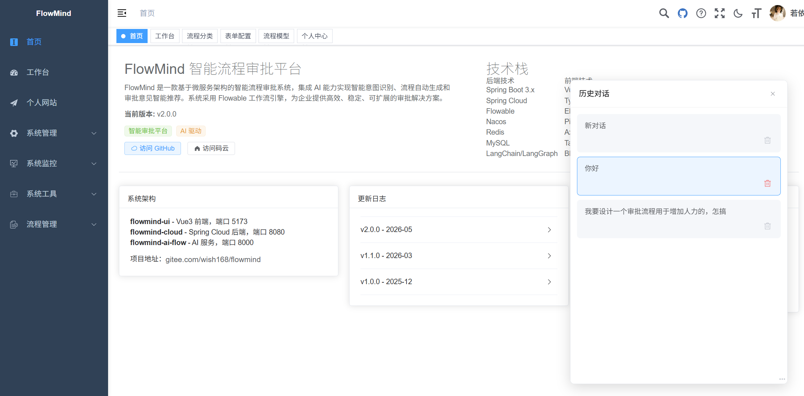
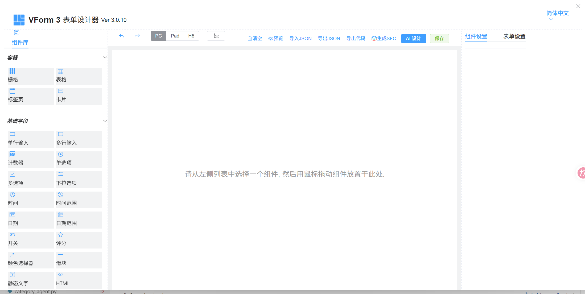
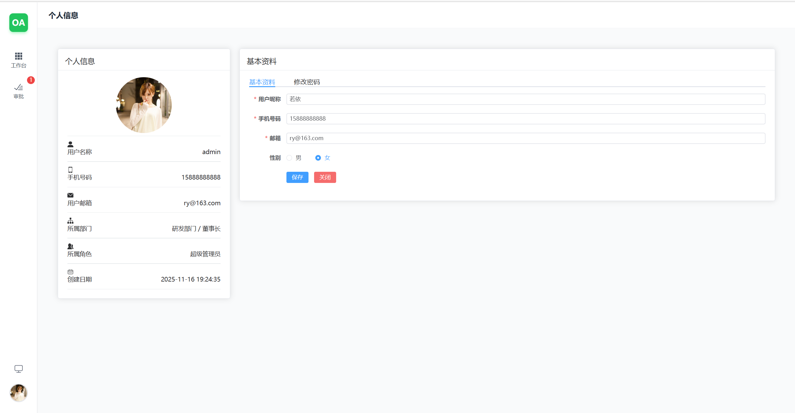

<p align="center">
	
</p>
<h1 align="center" style="margin: 30px 0 30px; font-weight: bold;">FlowMind</h1>
<h4 align="center">基于 RuoYi-Cloud + Flowable 的智能工作流管理系统</h4>
<p align="center">
	<a href="https://gitee.com/wish168/flowmind"></a>
	<a href="https://github.com/Moonlight168/flowmind"></a>
	<a href="https://gitee.com/wish168/flowmind/blob/master/LICENSE"></a>
</p>

## 项目简介

FlowMind 是一款**智能流程审批系统**，集成 AI 能力实现智能意图识别、流程自动生成和审批意见智能推荐。系统采用微服务架构，包含三个主要子项目：

| 子项目                     | 技术栈                  | 端口    | 职责                            |
| -------------------------- | ----------------------- | ------- | ------------------------------- |
| **flowmind-ui**      | Vue 3 + Element Plus    | 5173/80 | 用户界面、AI 助手、审批中心     |
| **flowmind-cloud**   | Spring Cloud + Flowable | 8080    | 业务逻辑、Flowable 流程引擎     |
| **flowmind-ai-flow** | FastAPI + LangGraph     | 8000    | AI 意图识别、流程设计、表单生成 |

## 核心特性

### AI 智能设计

通过自然语言描述，自动生成流程分类、BPMN 流程结构和用户表单：

| 功能                  | 说明                                          |
| --------------------- | --------------------------------------------- |
| **AI 设计分类** | 自然语言描述 → 自动生成流程分类              |
| **AI 设计流程** | 业务需求描述 → 自动生成 BPMN 2.0 流程        |
| **AI 设计表单** | 表单内容描述 → 自动生成 v-form-designer 表单 |
| **React 模式** | 基于 ReAct 架构的智能 Agent，支持多轮追问     |
| **追问优化**    | AI 主动询问细节，持续优化设计结果直到满意    |

### React 模式 Agent

全新的 Agent 架构，采用 Reasoning + Acting 模式：

- **智能推理**：AI 分析用户意图，规划执行步骤
- **工具调用**：动态调用 BPMN 设计、表单生成等工具
- **追问机制**：主动询问缺失信息，确保设计完整
- **结果验证**：自动验证生成结果的正确性

### 全局 AI 助手

悬浮式 AI 助手，随时随地调用 AI 能力：

- 对话历史自动保存
- 支持查看、继续和删除对话
- 一键跳转到对应设计页面

### 审批中心

统一的流程审批管理界面：

- **待办事项**：需要处理的审批任务
- **已办事项**：已完成的审批记录
- **我的流程**：我发起的流程申请
- **待签收**：需要签收的任务

### 草稿箱

- 流程草稿随时保存
- 编辑、删除、提交
- 与审批中心无缝集成

## 系统架构

```
┌─────────────────────────────────────────────────────────────────┐
│                        前端层 (flowmind-ui)                      │
│              Vue 3 + Element Plus + BPMN-JS                     │
└─────────────────────────────────────────────────────────────────┘
                              │
                              ▼ HTTP
┌─────────────────────────────────────────────────────────────────┐
│                    API 网关 (Spring Cloud Gateway)               │
└─────────────────────────────────────────────────────────────────┘
                    │                       │
                    ▼                       ▼
         ┌──────────────────┐    ┌─────────────────────┐
         │  业务模块        │    │  AI 服务            │
         │  (Flowable)      │    │  (FastAPI+LangGraph)│
         └──────────────────┘    └─────────────────────┘
```

## 技术栈

| 层级     | 技术                                                    |
| -------- | ------------------------------------------------------- |
| 前端     | Vue 3 / Element Plus / Vite / BPMN-JS / v-form-designer |
| 后端     | Spring Boot 3.x / Spring Cloud / Flowable 6.x / Nacos   |
| AI       | FastAPI / LangChain / LangGraph / Redis                 |
| 基础设施 | MySQL / Redis / Docker                                  |

## 演示图

### AI 功能

<table>
    <tr>
        <td><br/><div style="text-align: center;">全局 AI 助手</div></td>
        <td><br/><div style="text-align: center;">对话历史管理</div></td>
    </tr>
    <tr>
        <td><br/><div style="text-align: center;">AI 设计分类</div></td>
        <td><br/><div style="text-align: center;">AI 生成流程</div></td>
    </tr>
</table>

### OA 工作台

<table>
    <tr>
        <td><br/><div style="text-align: center;">工作台</div></td>
        <td><br/><div style="text-align: center;">流程发起</div></td>
    </tr>
    <tr>
        <td><br/><div style="text-align: center;">审批中心</div></td>
        <td><br/><div style="text-align: center;">我的流程</div></td>
    </tr>
    <tr>
        <td><br/><div style="text-align: center;">草稿箱</div></td>
        <td><br/><div style="text-align: center;">个人信息</div></td>
    </tr>
</table>

### 流程管理

<table>
    <tr>
        <td><br/><div style="text-align: center;">流程分类</div></td>
        <td><br/><div style="text-align: center;">流程设计</div></td>
    </tr>
    <tr>
        <td><br/><div style="text-align: center;">流程部署</div></td>
        <td><br/><div style="text-align: center;">表单编辑</div></td>
    </tr>
</table>

## 快速开始

### 生产环境（Docker 一键启动）

一键构建：Java 后端 + 前端，并复制构建产物到 Docker 目录：

```bash
bin\build.bat
```

构建产物：

- Java JAR → `docker/cloud/ruoyi/*/jar/`
- 前端 dist → `docker/cloud/nginx/html/dist/`

启动：

```bash
cd docker\flowmind
docker-compose -f docker-compose.prod.yml up -d --build
```

### 开发环境（启动脚本）

前提：Docker 服务已启动且可用

```bash
bin\start.bat
```

自动启动：Docker 基础环境 → Java 后端 → 前端

**已启动服务**：Gateway (9001)、Auth (9200)、System (9201)、Flowable (9204)

**未启动（可选）**：File (9202)、Gen (9203)、Job (9205)、Visual

AI 服务（需单独启动）：

```bash
cd flowmind-ai-flow/ai-service
poetry install
poetry run uvicorn app.main:app --reload --host 0.0.0.0 --port 8000
```

## 服务端口

| 服务     | 端口    | 访问地址                    |
| -------- | ------- | --------------------------- |
| 前端     | 5173/80 | http://localhost:5173       |
| API 网关 | 8080    | http://localhost:8080       |
| AI 服务  | 8000    | http://localhost:8000       |
| Nacos    | 8848    | http://localhost:8848/nacos |
| MySQL    | 3306    | localhost:3306              |
| Redis    | 6379    | localhost:6379              |

## 项目仓库

| 平台             | 地址                                     |
| ---------------- | ---------------------------------------- |
| **GitHub** | https://github.com/Moonlight168/flowmind |
| **Gitee**  | https://gitee.com/wish168/flowmind       |

## 子项目详情

| 项目                                          | 描述                              |
| --------------------------------------------- | --------------------------------- |
| [flowmind-ui](./flowmind-ui/README.md)           | 前端项目，Vue 3 + Element Plus    |
| [flowmind-cloud](./flowmind-cloud/README.md)     | 后端项目，Spring Cloud + Flowable |
| [flowmind-ai-flow](./flowmind-ai-flow/README.md) | AI 服务，FastAPI + LangGraph      |

---

基于 [RuoYi-Cloud](https://gitee.com/y_project/RuoYi-Cloud) 扩展开发，遵循 [Apache License 2.0](https://github.com/Moonlight168/flowmind/blob/master/LICENSE) 开源协议。

**最后更新**: 2026-06-04
