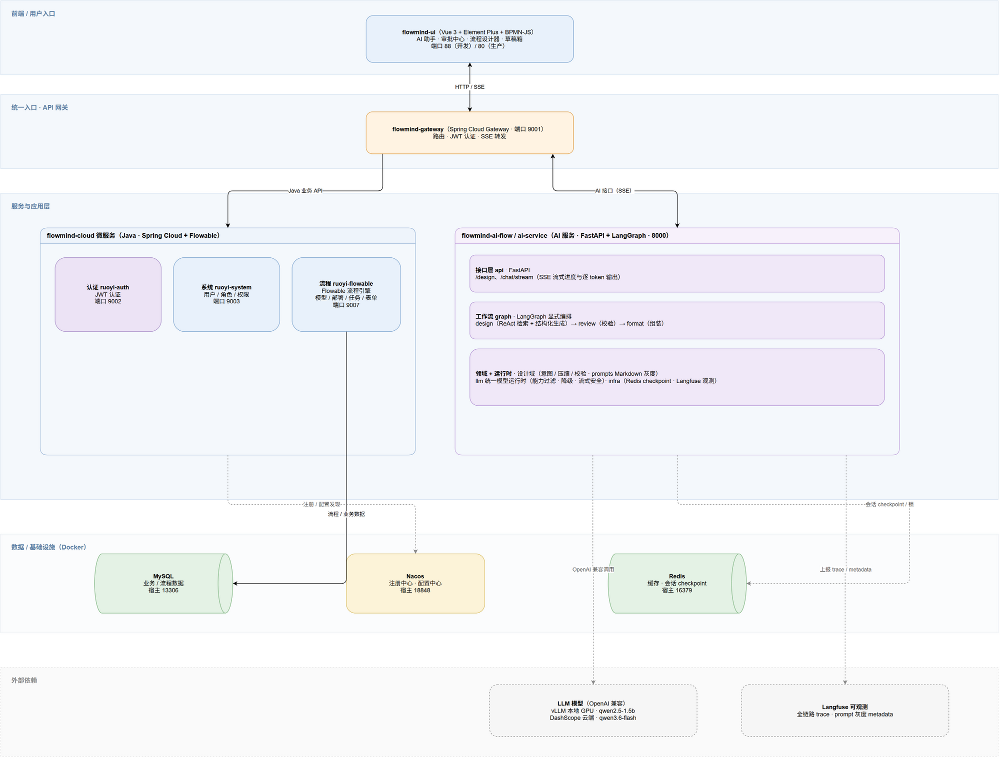

# 基于大语言模型的智能流程审批系统设计与实现

## 本科毕业设计（论文）

| 项目 | 内容 |
|---|---|
| 学校 | ______________________________ |
| 学院（系） | ______________________________ |
| 专业 | ______________________________ |
| 学生姓名 | ______________________________ |
| 学号 | ______________________________ |
| 指导教师 | ______________________________ |
| 完成日期 | ______年____月____日 |

> 原创性声明：本人郑重声明，所提交的毕业设计（论文）是在指导教师指导下独立完成的研究成果。除文中已经注明引用的内容外，本文不包含他人已经发表或撰写的研究成果。具体声明格式以所在学校要求为准。

# 摘要

传统审批系统通常依赖业务管理员在可视化设计器中手工配置流程节点、顺序流、审批角色和动态表单。该方式虽然具有较强的确定性，但对 BPMN 语法和流程引擎知识要求较高，当业务规则频繁调整时还会产生较大的沟通与维护成本。大语言模型能够理解自然语言需求，却具有输出概率性和事实幻觉问题，若直接生成完整 BPMN XML 或表单 JSON，容易造成节点遗漏、引用错误和已有设计被覆盖。

针对上述问题，本文设计并实现了 FlowMind 智能流程审批系统。系统采用 Vue 3、Spring Cloud、Flowable、FastAPI 与 LangGraph 构成的前后端分离微服务架构，支持流程分类、流程模型、动态表单、流程部署、任务审批、草稿和全局 AI 助手等功能。在 AI 设计链路中，本文提出一种面向流程领域的增量操作方法：大语言模型不直接重写完整模型，而是输出新增、修改、删除、移动等结构化操作；服务端在原设计副本上应用操作，并依次完成 Pydantic 结构校验、BPMN/VForm3 语法校验和业务规则校验。系统通过 ReAct 工具调用查询真实分类、角色、表单和流程模型，降低业务数据幻觉；通过 `prepare → design → review → format` 状态机实现错误反馈和有限重试；通过 Redis checkpoint 保持多轮会话，通过 SSE 提供进度和 token 流式响应。候选结果只有在校验通过后才进入变更预览，用户确认后才应用，失败时保留原设计。

为提高系统可维护性，本文还实现了统一模型 Provider 降级、Markdown 提示词版本及灰度发布、Langfuse 全链路追踪，以及支持单条和全量执行的黄金数据集评估。测试结果表明，系统的 228 项单元、集成与系统测试全部通过，其中真实系统测试覆盖了 FastAPI 认证、SSE、LangGraph、模型调用和 Redis checkpoint 链路。该系统验证了将概率性生成能力置于确定性软件约束和人工确认机制之中的可行性，可为中小型组织的智能审批和低代码流程设计提供参考。

**关键词：** 大语言模型；智能审批；BPMN；LangGraph；Flowable；增量设计；可观测性

# Abstract

Traditional workflow approval systems require administrators to manually configure process nodes, sequence flows, approval roles, and dynamic forms in visual designers. Although this approach is deterministic, it requires knowledge of BPMN and workflow engines and incurs considerable communication and maintenance costs when business rules change frequently. Large language models can understand natural-language requirements, but their probabilistic outputs and hallucinations make direct generation of complete BPMN XML or form JSON unsafe, potentially causing missing nodes, invalid references, and unintended overwrites.

This thesis designs and implements FlowMind, an intelligent workflow approval system based on a separated microservice architecture using Vue 3, Spring Cloud, Flowable, FastAPI, and LangGraph. The system supports workflow categories, process models, dynamic forms, deployment, approval tasks, drafts, and a global AI assistant. A domain-oriented incremental operation approach is introduced for AI-assisted design. Instead of rewriting an entire model, the language model produces typed operations such as add, update, remove, and move. The server applies these operations to a copy of the original design and performs Pydantic structural validation, BPMN/VForm3 syntax validation, and business-rule validation. ReAct tools retrieve authoritative categories, roles, forms, and process models to reduce hallucinations. A `prepare → design → review → format` state machine provides validation feedback and bounded retries. Redis checkpoints preserve multi-turn state, while Server-Sent Events deliver progress and token streams. A validated candidate is shown as a change preview and is applied only after user confirmation; failures never overwrite the original design.

The system further provides unified model-provider failover, Markdown-based prompt versioning and canary rollout, Langfuse end-to-end tracing, and golden-dataset evaluation that supports both full and single-case execution. A total of 228 unit, integration, and system tests passed. The real system-level tests cover FastAPI authentication, SSE, LangGraph execution, model invocation, and Redis checkpointing. The implementation demonstrates that probabilistic generation can be safely integrated into deterministic software constraints and human confirmation, providing a practical reference for intelligent approval and low-code process design.

**Key Words:** Large Language Model; Intelligent Approval; BPMN; LangGraph; Flowable; Incremental Design; Observability

# 目录

1. 绪论
2. 相关技术与理论基础
3. 系统需求分析
4. 系统总体设计
5. 智能流程设计关键技术
6. 系统详细实现
7. 系统测试与结果分析
8. 总结与展望
9. 参考文献
10. 致谢
11. 附录

# 第1章 绪论

## 1.1 研究背景

组织内部的请假、报销、采购、合同、用印等业务都需要按照既定规则进行审批。随着业务规模扩大，纸质审批和简单表格难以满足状态跟踪、权限控制、审计与跨部门协作要求，工作流管理系统因此成为企业信息化的重要组成部分。

BPMN（Business Process Model and Notation）提供了一套统一的业务流程建模符号和 XML 交换格式。BPMN 2.0.2 规范定义了事件、任务、网关和顺序流等核心元素，使业务分析、软件开发和流程执行可以围绕同一模型沟通[1]。Flowable 等流程引擎能够部署 BPMN 2.0 定义、创建实例、办理任务和查询历史[2]。然而，标准和引擎解决的是模型表达与执行问题，并没有完全解决建模门槛问题。业务人员仍需理解流程符号、候选角色、条件表达式和表单绑定。

近年来，大语言模型在自然语言理解、代码生成和工具调用方面快速发展。用户可以直接描述“金额超过一万元由总监审批，否则由部门经理审批”，模型能够提取角色、条件和步骤。ReAct 方法通过交替执行推理和行动，使模型可以访问外部知识源，并利用观察结果继续完成任务[3]。这一方法适合查询企业已有角色、分类和表单。但大语言模型并不是确定性程序：相同输入可能得到不同结构，也可能生成不存在的角色、错误的节点类型或不合法的 XML。若把模型结果直接保存或部署，会将概率性错误传递到核心业务。

因此，本课题研究如何在不牺牲流程正确性和用户控制权的前提下，引入自然语言设计能力。本文的基本观点是：模型负责理解意图和提出候选变更，程序负责应用操作、验证规则和保护基线，用户负责最终确认。

## 1.2 研究目的与意义

本研究的直接目的是实现一套可运行的智能流程审批系统，使普通用户可以通过自然语言创建或修改流程分类、BPMN 模型和动态表单。系统还应具备审批任务、草稿、部署、历史、权限等传统功能，避免 AI 能力与业务系统脱节。

在工程层面，本文希望解决四类问题。第一，降低自然语言到流程模型的转换门槛；第二，保护用户已有流程，避免全量重写带来的数据损失；第三，用确定性规则约束概率性模型输出；第四，为模型、提示词和工具链建立可观察、可回归的质量体系。

本研究的实践意义在于缩短流程配置周期，提高中小型组织的数字化效率。其方法也可推广到规则配置、低代码页面和其他结构化生成场景。理论意义则在于探索“智能体生成—领域操作—规则验证—人工确认”这一人机协同范式。

## 1.3 国内外研究与应用现状

国外工作流研究起步较早，BPMN 已形成由 OMG 维护的标准体系[1]。Flowable、Camunda 等引擎提供模型部署、流程实例和任务管理能力，其中 Flowable 既可嵌入 Java 应用，也可通过 REST API 使用[2]。国内政企软件广泛采用工作流引擎和可视化低代码平台，常见做法是通过拖拽配置审批节点和表单。此类平台降低了编码量，但复杂流程仍依赖专业配置人员。

大模型智能体研究关注模型与外部环境的交互。ReAct 通过推理轨迹与行动交替，提升了模型调用知识库和处理异常的能力[3]。LangGraph 将智能体表示为带状态的图，提供持久化、流式执行和人工介入等基础能力[4]。大模型工程实践开始重视链路追踪、数据集和实验对比；Langfuse 以 trace、observation、session 和 dataset run 等对象组织观测与评估[5][6]。

现有方案通常侧重某个局部：流程平台重执行确定性但自然语言能力有限；通用智能体善于生成但缺少流程领域约束；低代码 AI 助手常采用完整模型重写，难以证明对原设计无损。本文从完整业务链出发，把工具检索、结构化操作、领域校验、用户预览和可观测评估组合起来。

## 1.4 研究内容

本文主要完成以下工作：

1. 设计前端、微服务业务端和 AI 服务协同的系统架构；
2. 实现流程分类、模型、表单、部署、审批中心和草稿等业务模块；
3. 使用 LangGraph 实现有状态 AI 设计工作流；
4. 设计分类、流程和表单的增量操作协议；
5. 实现 BPMN 2.0、VForm3 及业务规则的多层校验；
6. 实现 ReAct 权威数据检索、多模型降级和安全兜底；
7. 实现 SSE 流式响应、Redis checkpoint 和会话隔离；
8. 实现提示词版本灰度、Langfuse 追踪和黄金数据集评估；
9. 通过单元、集成和系统测试验证系统正确性。

## 1.5 论文组织结构

第一章介绍背景、意义和研究内容；第二章说明 BPMN、Flowable、微服务、大模型智能体和可观测评估技术；第三章完成用户、功能和非功能需求分析；第四章描述总体架构、模块和数据设计；第五章重点论述增量操作、检索、校验、降级和预览机制；第六章介绍系统实现；第七章给出测试方案和结果；第八章总结工作并提出后续方向。

# 第2章 相关技术与理论基础

## 2.1 BPMN 2.0 与流程执行

BPMN 是业务流程领域的标准建模语言。其核心元素可分为流对象、连接对象、泳道和附加工件。FlowMind 当前重点处理开始事件、结束事件、用户任务、服务任务、排他网关、并行网关和顺序流。BPMN XML 不仅包含流程语义，还可能包含扩展属性、监听器和 BPMN-DI 图形坐标。因此，模型修改不能只关注节点数组，还要保护 XML 中未被用户提及的信息。

Flowable 是轻量级 Java 流程引擎，可以部署 BPMN 2.0 流程定义、创建流程实例、执行查询并访问运行及历史数据[2]。本系统由 Flowable 服务承担流程模型保存、部署、实例运行和任务管理，AI 服务只生成通过校验的候选模型，不直接替代引擎。

## 2.2 Vue 3 与可视化设计器

Vue 3 采用声明式、组件化和响应式的界面开发模型[7]。系统前端使用 Vue 3、Vite 和 Element Plus 实现管理后台，通过 BPMN-JS 展示及编辑流程图，通过 VForm3 编辑动态表单。AI 弹窗与设计器之间采用候选数据交互：弹窗维护流式会话和操作摘要，设计器负责真实渲染；用户点击应用后才替换正式页面状态。

## 2.3 Spring Cloud 微服务架构

Spring Cloud 为配置管理、服务发现、路由、负载均衡等分布式系统模式提供支持[8]。FlowMind 以 RuoYi-Cloud 为基础，将网关、认证、系统管理和 Flowable 服务拆分。网关统一接收前端请求并透传用户令牌；认证服务负责登录；系统服务提供用户、部门和角色；Flowable 服务管理流程业务。

## 2.4 FastAPI 与 Pydantic

FastAPI 是基于 Python 类型注解构建 API 的 Web 框架，并与 Pydantic 数据校验结合[9]。AI 服务使用 Pydantic 定义请求 DTO、LangGraph 状态和模型结构化输出。Schema 配置禁止未知字段，使模型返回不符合契约时能够尽早失败，避免错误延迟到 BPMN 生成阶段。

## 2.5 大语言模型与 ReAct

普通提示生成把所有事实和规则放入上下文，模型容易受窗口长度和知识时效影响。ReAct 将推理与行动交替：模型先判断需要什么信息，再调用工具，读取观察结果后继续生成[3]。本系统提供 `search_categories`、`search_roles`、`search_forms` 和 `search_flow_models` 四类只读工具，使模型依据后端权威数据选择对象。

工具调用并不能完全消除错误。模型可能不调用工具、误解返回值或在最终答案中重新编造。因此系统在生成后仍执行确定性业务校验，形成检索和校验两个独立防线。

## 2.6 LangGraph 状态机

LangGraph 面向长运行、有状态智能体，提供图编排、持久化、流式输出和人工介入能力[4]。其 checkpoint 会按 thread 保存图状态，可用于多轮会话记忆和失败后的状态恢复[10]。本系统选择显式图结构，而非把意图、检索、生成、校验和格式化放在一个函数中，从而能够清楚观察每一阶段并设置不同的错误处理策略。

## 2.7 Redis 状态存储

Redis 用于保存 LangGraph checkpoint、会话摘要和设计锁。Redis 支持字符串、集合等数据结构[11]，并可按可靠性需要采用 RDB、AOF 或组合持久化方式[12]。本系统为 checkpoint 设置 TTL，避免无期限占用存储；同一 thread 的并发修改通过 `SET NX EX` 风格的锁控制，并用随机 ownership token 配合比较删除保证释放安全。

## 2.8 Langfuse 可观测与评估

大模型调用链通常包含多个模型请求、工具和重试，传统日志很难还原完整上下文。Langfuse 使用 observation 表示步骤、trace 聚合同一请求、session 聚合多轮会话[5]。其数据集可保存输入和期望输出，并将实验运行及评分关联到 Dataset Run[6]。本系统用业务 trace_id 连接应用日志和 Langfuse，用 thread_id 连接多轮记录。

# 第3章 系统需求分析

## 3.1 用户角色分析

系统主要包括以下角色：

| 角色 | 主要职责 |
|---|---|
| 普通员工 | 发起流程、保存草稿、查看本人流程、处理分配任务 |
| 审批人员 | 查看待办、签收任务、填写审批意见、完成审批 |
| 流程管理员 | 管理分类、表单、流程模型、部署和版本 |
| 系统管理员 | 管理用户、部门、角色、菜单和系统配置 |
| 开发运维人员 | 配置模型、监控链路、执行黄金集和处理故障 |

AI 设计功能主要服务于流程管理员，但也可根据权限开放给业务人员。无论何种角色，AI 结果都不能绕过现有权限体系直接部署。

## 3.2 功能需求

### 3.2.1 基础管理需求

系统应支持用户登录、JWT 认证、角色权限、部门和菜单管理；支持流程分类和表单的新增、修改、查询与删除；支持流程模型编辑、版本、部署和状态管理。

### 3.2.2 审批业务需求

用户能够选择已部署流程发起申请，填写关联表单，保存草稿并查询进度。审批人员能够在待办、待签、已办等视图中处理任务。系统需保存运行状态和历史信息。

### 3.2.3 AI 设计需求

AI 设计分为分类设计、流程基本信息设计、完整流程设计和表单设计。用户可以从空白开始，也可以提供当前设计并提出增量修改。信息不足时系统应追问；用户表达回退时应恢复初始版或上一版；只有明确勾选“全部重新生成”并二次确认后，服务端才接受整体替换操作。

### 3.2.4 变更预览需求

成功响应包含候选 `form_data`、操作列表、操作数量和校验结果。前端对 BPMN 和表单使用真实设计器渲染候选数据，对分类及基本信息展示字段差异。用户选择应用后更新页面状态，选择取消则不发生变化。

### 3.2.5 观测评估需求

每个请求需要具备 trace_id，工作流节点、工具调用、模型 Provider 尝试和最终输出应处于同一追踪链。提示词实际版本及灰度组写入 metadata。黄金数据集支持按用例 ID 单独运行，也支持全量回归。

## 3.3 非功能需求

### 3.3.1 正确性

流程候选必须满足节点和连线基本约束，生成的 BPMN XML 能被解析并符合引擎所需结构；表单候选必须符合 VForm3 组件数据格式；角色、分类和表单引用必须来自后端有效数据。

### 3.3.2 安全性

所有 AI 业务接口必须认证。API Key、JWT 密钥和 Langfuse 密钥只从环境变量读取。日志不输出敏感凭据。模型或校验失败时不得返回可直接覆盖用户设计的草稿。

### 3.3.3 可用性

系统通过 SSE 及时反馈准备、生成、校验和组装阶段，减少长时间等待的不确定感。模型 Provider 在安全条件下可自动降级。AI 服务不可用时，传统人工设计和审批能力仍可使用。

### 3.3.4 可维护性

提示词与业务代码分离；模型选择集中在统一运行时；校验规则具有稳定 rule_id；环境开关由 Settings 统一解析；核心功能具有自动化测试。

### 3.3.5 可扩展性

通过结构化模型可扩展新的操作类型，通过工具模块可增加新的业务目录，通过 Provider 配置可接入其他 OpenAI-compatible 模型。扩展必须保持现有响应状态和安全边界。

## 3.4 典型用例

以“在现有请假流程的经理审批后增加财务复核”为例：用户打开流程设计器，AI 弹窗读取当前 BPMN；用户输入修改要求；模型检索角色并输出 `add_node` 操作，指定 `after_id` 为经理审批节点；服务端将原顺序流重连为“经理审批—财务复核—后续节点”；review 验证角色和图连通性；前端展示新流程图和操作摘要；用户确认后应用。过程中原节点 ID、扩展属性和未涉及连线均保持不变。

# 第4章 系统总体设计

## 4.1 设计原则

系统遵循职责分离、默认安全、增量优先、确定性校验和可观察五项原则。前端负责交互与预览，Java 服务负责业务事实和流程生命周期，AI 服务负责自然语言设计，流程引擎负责执行。任何层都不应越过另一层的核心职责。

## 4.2 总体架构



系统由三个主要子项目组成：

1. `flowmind-ui`：Vue 3 管理端，提供审批业务页面、AI 弹窗、BPMN 和表单设计器；
2. `flowmind-cloud`：Spring Cloud 微服务，包含 Gateway、Auth、System 和 Flowable 等模块；
3. `flowmind-ai-flow`：FastAPI 与 LangGraph 服务，完成聊天、智能设计、校验、观测和评估。

浏览器一般通过网关访问业务服务。AI 设计请求同样由网关转发，令牌在转发过程中保持，AI 服务独立校验 JWT。AI 工具访问 Java 后端时复用当前请求认证上下文，避免使用固定高权限账号。

## 4.3 AI 服务分层

AI 服务采用以下层次：

| 层 | 目录 | 职责 |
|---|---|---|
| API 层 | `app/api` | 请求 DTO、JWT 依赖、SSE 响应和安全错误 |
| 编排层 | `app/graph` | 设计图、聊天图、状态、路由和 checkpoint |
| 领域层 | `app/design` | 意图、生成、操作应用、历史压缩、BPMN/VForm3 和校验 |
| 模型层 | `app/llm` | Provider 构建、能力过滤、重试、降级和流式策略 |
| 集成层 | `app/integrations/backend` | 分类、角色、表单和模型查询客户端 |
| 基础设施层 | `app/infra` | Redis、日志、Langfuse 和 Nacos |
| 配置层 | `app/config` | `.env` 类型化配置与功能开关 |
| 评估层 | `app/evaluation` | 黄金集加载、执行、评分与上报 |

## 4.4 业务模块设计

Java 后端按 Controller、Service、Mapper 分层。Gateway 负责路由，Auth 负责认证，System 管理组织与权限，Flowable 模块管理流程分类、表单、模型、部署、实例和任务。MySQL 保存业务实体和 Flowable 引擎表；Redis 保存认证缓存及 AI 会话状态。

前端按 API、视图、组件和状态划分。`AiDesignDialog` 负责用户输入、多轮消息、SSE 事件和变更操作展示；`ProcessDesigner` 负责 BPMN 渲染、自动布局和应用候选模型；表单页面调用 VForm3 设计器显示候选 JSON。

## 4.5 核心数据与接口

AI 设计请求的关键字段如下：

| 字段 | 类型 | 说明 |
|---|---|---|
| `user_input` | string | 用户自然语言要求 |
| `current_form_data` | object/null | 当前分类、流程或表单基线 |
| `mode` | basic/design | 流程基本信息或完整设计模式 |
| `thread_id` | string/null | 多轮会话和设计对象标识 |
| `allow_full_replace` | boolean | 是否已完成整体替换二次确认 |

最终状态统一为：

- `ready`：候选结果已通过校验，可以预览但尚未应用；
- `needs_input`：关键信息不足，需要用户继续补充；
- `error`：生成、依赖或校验失败，`form_data` 为空。

## 4.6 部署设计

开发环境使用启动脚本依次拉起 Docker 基础设施、AI 服务、Java 微服务和前端。生产环境使用 Docker Compose 编排 MySQL、Redis、Nacos、Langfuse、Java 服务、AI 服务和 Nginx。所有模型、降级、灰度、观测、校验和基础设施参数通过 `.env` 注入，避免业务模块直接读取不同来源的环境变量。

# 第5章 智能流程设计关键技术

## 5.1 有状态设计工作流

设计图包含四个稳定节点：

```text
START → prepare → design → review ──通过──→ format → END
                         ▲    │
                         └────┘ 可修复错误且未超预算
```

prepare 节点校验设计类型和模式，解析当前 BPMN 或 VForm3 数据并建立标准化基线。design 节点处理意图、历史压缩、ReAct 检索和结构化生成。review 节点执行确定性校验；错误会以 rule_id 和说明加入上下文，再路由回 design。format 节点统一生成前端契约。节点拆分使错误发生位置和耗时能够被 Langfuse 明确记录。

多轮状态由 Redis checkpointer 按 thread 保存。用户补充信息时使用同一 thread_id，工作流恢复历史消息和当前设计上下文。系统的信息补充和预览确认采用普通多轮请求，而不是服务端无限期暂停：当前动作不会直接产生部署或删除等副作用，保持终态响应更简单，也更符合 Web 接口超时边界。

## 5.2 意图识别与上下文处理

意图阶段只区分设计、追问和回退。是否允许全部重新生成不是自然语言隐式意图，而是前端明确勾选并确认后传入的授权标志。这样可以避免模型把“重新整理一下”误解为删除全部内容。

长会话采用分层压缩：保留系统提示和最近消息，中间历史超过阈值时生成摘要；摘要失败则退回确定性裁剪。摘要与普通聊天、意图识别和设计生成都通过统一模型运行时执行，从而共享 Provider 能力和降级规则。

## 5.3 ReAct 权威目录检索

模型可使用四类工具：分类检索、角色检索、表单检索和流程模型检索。工具通过当前 JWT 调用后端 API，并在一次工作流执行中缓存相同查询。工具输出只包含生成所需字段，降低上下文体积。

设计阶段分为 ReAct 工具阶段和结构化收尾阶段。前一阶段允许模型调用工具；后一阶段移除消息中的 tool-call 元数据，只保留用户需求、工具观察和必要的 AI 文本，再绑定 Pydantic Schema 生成操作。这种隔离避免模型在已解绑工具的结构化请求中继续发出工具调用。

## 5.4 结构化增量操作协议

流程操作包括：

- `add_node`：新增节点，可指定 `after_id`；
- `update_node`：按节点 ID 修改字段；
- `remove_node`：删除节点并按可确定条件重连；
- `add_edge`、`update_edge`、`remove_edge`：维护顺序流；
- `update_flow_metadata`：仅修改流程基本信息；
- `replace_graph`：整体替换，仅在显式授权时可用。

表单操作包括新增、更新、删除和移动控件，以及经授权的整体替换。分类操作主要更新名称、编码和备注。所有操作先应用于 `deepcopy` 得到的候选对象，原始输入不会被修改。

对于 `add_node.after_id`，应用器检查插入位置的出边。如果没有出边，则创建“原节点—新节点”；如果只有一条出边，则把原边的后半段移动到新节点，并保留原边 ID 和条件元数据。若有多条出边，应用器拒绝猜测具体分支，要求模型明确目标。当前批次生成的无元数据自动边可由紧随其后的显式 `add_edge` 补全 ID，但基线中同源同目标、条件不同的合法边不会被覆盖。

## 5.5 BPMN 无损合并与布局

流程模型不能只靠节点和连线数组重建。原 BPMN DOM 可能包含 Flowable 扩展属性、执行监听器、表单绑定、边界事件和未知命名空间元素。系统解析原始 DOM，根据已验证操作更新对应元素，未涉及元素原样保留。

对于已有 BPMN-DI 坐标，系统保留原节点位置并只为新增节点计算位置；对于新建图或缺少完整 DI 的模型，使用确定性布局生成节点边界和连线路径。前端加载候选 XML 后执行画布适配，解决全量导入时节点挤在局部区域、必须手动拖动才舒展的问题。

## 5.6 VForm3 转换与校验

VForm3 表单以 `widgetList` 和 `formConfig` 为核心。控件名称是业务数据键，必须存在且不能冲突。系统支持普通控件及卡片、栅格、标签页等嵌套容器，在更新或移动时递归定位控件，并限制嵌套控件只能在合法容器内移动。

表单校验包括 JSON 可解析性、控件类型白名单、`options.name` 必填与唯一、必要属性、嵌套结构和业务字段规则。转换器最终输出设计器可直接加载的完整 JSON，而不是只有字段列表的简化草稿。

## 5.7 双层校验与有限重试

校验分为三部分：

1. **结构校验**：Pydantic 检查字段类型、必填项和未知字段；
2. **语法校验**：检查 BPMN XML、节点/连线引用和 VForm3 JSON；
3. **业务校验**：检查起止事件、连通性、分支条件、审批角色、分类编码冲突和表单规则。

每条规则都有稳定 rule_id。review 不通过时，错误作为明确反馈交给模型重新生成操作，而不是让模型重新猜测全部上下文。重试预算与 Provider 故障重试预算分开计算。连续两次出现相同 rule_id 集合说明模型可能陷入死循环，系统提前结束并返回 error。

## 5.8 模型运行时与降级策略

统一模型运行时接收任务名、消息、是否需要结构化输出和是否流式等参数。它依据 `.env` 中的优先级选择 Provider，并过滤不支持结构化输出的模型。不同 Provider 可配置 `extra_body` 和 `json_schema`、`function_calling`、`json_mode` 等结构化方式，配置值在使用前进行白名单校验。

可重试的连接、超时和限流错误在预算内切换 Provider；Schema 校验错误属于内容问题，进入设计校验循环，不触发基础设施降级。普通非流式请求在 Provider 失败后可以完整重试。流式请求只有在首 token 发出前可以切换，一旦已经向用户输出内容，后续异常必须结束当前流，防止备用模型从头生成造成重复文本。

## 5.9 错误兜底与用户确认

LangGraph 节点使用统一装饰器记录耗时和预期异常。设计链异常被转换为可路由的错误状态，最终返回 `status=error`、友好消息和 trace_id，不附带候选 `form_data`。普通聊天异常返回稳定提示，但不会伪装成正常模型答案。未知编程错误不由宽泛异常吞掉，以便测试和监控及时暴露。

成功也不意味着自动保存。前端使用变更预览显示候选设计及操作摘要，用户点击应用后才更新设计器。全部重新生成仍属于操作协议中的 `replace`，但必须有本次请求的显式授权。

## 5.10 提示词版本和灰度发布

角色、任务、BPMN 知识、意图、聊天、摘要及工具说明均保存在 Markdown 文件中。加载器只替换显式变量，不破坏 JSON 示例或 BPMN `${expression}`。版本清单记录稳定版、候选文件和权重，系统以 `thread_id + prompt_path` 做稳定哈希，使同一会话始终落入同一版本。环境变量可强制指定版本实现快速回滚，实际版本和 cohort 写入 Langfuse metadata。

## 5.11 全链路可观测与黄金集

每次设计或聊天建立工作流根 trace，输入输出、用户、session 和业务 trace_id 在统一上下文中传播。LangGraph 节点、ReAct Agent、工具、每次模型 Provider 尝试和结构化调用均形成子 observation。即使 Langfuse 未配置或暂时失败，观测模块也保持 no-op，不影响主业务。

黄金数据集使用 JSONL，每条记录具有稳定 ID，并统一使用 `turns` 表达单轮或多轮会话。期望结果描述意图、必要字段、最小节点数量、审批或网关类型、表单控件及失败兜底等稳定契约，而不是模型自然语言逐字匹配。脚本可执行全部用例或 `--case-id` 指定用例，并将输出和分数写入 Dataset Run。

# 第6章 系统详细实现

## 6.1 前端 AI 交互实现

AI 设计弹窗通过 `fetch` 读取 SSE 字节流，使用缓冲区处理一个事件跨多个网络分片的情况，并兼容 CRLF。设计接口依次产生 progress 和 done 事件，聊天接口产生 meta、delta 和 done 事件。只有收到 done 才把本次回答视为完整；若连接中断或缺失 done，界面显示可重试错误。

设计预览采用左右分工的交互思想：对话区域说明用户需求、生成状态和变更摘要，主设计区域复用 BPMN-JS 或 VForm3 展示真实候选结果。这样用户看到的是最终编辑器效果，而不是难以判断的 JSON 文本。窗口初次进入显示固定欢迎语，避免把系统内部状态暴露给用户。

前端维护打开设计器时的初始快照，并在每次应用后增加版本。用户要求回退时，可以恢复上一版或真正的初始版。版本快照只负责用户侧撤销体验，不与服务端 checkpoint 的会话记忆混为一谈。

## 6.2 网关认证链路实现

前端请求首先进入 Spring Cloud Gateway。网关在转发 AI 路由时保留用户令牌，AI 服务通过 `HTTPBearer` 读取凭据，使用与业务系统一致的 JWT 密钥验证用户 ID、用户名和 user_key。认证信息放入请求上下文，后端检索工具继续透传令牌。AI 内部 thread_id 使用用户身份、设计类型、模式和业务会话计算命名空间，防止不同用户共享同名会话。

## 6.3 SSE 桥接实现

LangGraph 当前提供同步生成器，而 FastAPI 响应使用异步流。系统通过一个有界队列和专用工作线程桥接。启动线程前复制请求 ContextVar，保证 JWT、trace_id、提示词版本和 Langfuse 上下文在线程切换后仍然存在。客户端断开时设置停止信号，生产线程在下一个事件边界停止并关闭源生成器，避免队列写满后永久占用线程和设计锁。

设计 SSE 的最终事件示例如下：

```json
{
  "type": "done",
  "status": "ready",
  "message": "已生成流程变更预览",
  "operations": [
    {"op": "add_node", "after_id": "manager", "node": {"id": "finance"}}
  ],
  "operation_count": 1,
  "validation": {"passed": true, "errors": []},
  "form_data": {"nodes": [], "edges": [], "bpmn_xml": "..."},
  "trace_id": "..."
}
```

## 6.4 Redis checkpoint 与锁实现

checkpoint 使用 `checkpoint:{namespace}:{thread_id}` 和 metadata 键保存序列化图状态，并设置过期时间。对话历史使用线程集合和详情键提供列表。删除历史时同时删除 checkpoint、metadata、详情和集合成员。

设计请求开始时尝试写入 `lock:design:{thread_id}`，参数为 `NX` 和过期时间。锁值采用随机 token。释放锁使用 Lua 脚本比较当前值和 token，只有持有者才能删除。即使旧请求执行超时，也不会误删后来请求重新取得的锁。

## 6.5 后端业务实现

Flowable 模块提供流程分类、表单、模型、部署、实例和任务接口。模型保存时持久化名称、编码、分类、BPMN XML 等内容；部署后由 Flowable RepositoryService 管理流程定义；运行时由 RuntimeService 启动实例；TaskService 完成签收和审批；HistoryService 支持已办和流程轨迹查询。

AI 服务的检索客户端调用列表接口并传递查询条件。分类编码修改时按当前 categoryId 排除自身，只要求与其他记录不冲突；编码冲突会反馈模型重试，名称不施加数据库不存在的唯一约束。角色始终查询后端，不在提示词中维护容易过期的静态列表。

## 6.6 环境配置实现

配置由 Pydantic Settings 分组管理，包括数据库、Redis、后端地址、Nacos、模型列表、Provider 优先级、降级预算、压缩策略、校验预算、Langfuse、提示词灰度和黄金集认证。业务模块只依赖 Settings 对象。`.env.example` 提供无密钥示例，真实 `.env` 被 Git 忽略。

## 6.7 Docker 与启动脚本

生产 Compose 编排应用依赖并使用健康检查控制启动顺序；开发脚本启动 Docker 基础环境，再启动 AI、Gateway、Auth、System、Flowable 和前端。脚本对端口进行检查，并将 AI 服务纳入统一启停流程。Nginx 对 SSE 关闭代理缓冲，接口响应也设置 `X-Accel-Buffering: no`，避免代理积攒事件后一次性返回。

# 第7章 系统测试与结果分析

## 7.1 测试目标与环境

测试目标是验证领域操作无损性、BPMN/VForm3 语法、业务规则、模型降级、多轮状态、SSE 契约和端到端集成。AI 服务使用 pytest 和 Ruff，前端使用 Vitest 与生产构建检查，Java 服务使用 Maven 测试和构建。

测试分为三层：单元测试隔离模型及外部服务，验证纯函数和边界；集成测试通过假模型执行完整 LangGraph；系统测试保留真实模型和 Redis，仅固定 Java 后端目录数据，以避免目录波动影响断言。系统测试使用独立 Redis DB，并只删除本用例新增键，不执行 `flushdb`，避免清空开发数据。

## 7.2 关键测试用例

| 编号 | 测试内容 | 预期结果 |
|---|---|---|
| T01 | 在已有流程中更新一个节点 | 未提及节点、连线和元数据保持不变 |
| T02 | 在单出边节点后插入审批节点 | 顺序流正确重连，原边元数据保留 |
| T03 | 同端点存在不同条件边 | 新增边不会覆盖基线条件边 |
| T04 | 模型输出孤立节点或多起点 | review 返回对应 rule_id 并重试 |
| T05 | 引用不存在的角色 | 业务校验失败，不返回可应用草稿 |
| T06 | VForm3 控件名称冲突 | 表单校验拒绝候选结果 |
| T07 | 信息不足 | 返回 `needs_input` 且保留会话 |
| T08 | 未授权整体替换 | replace 操作被拒绝 |
| T09 | 首 token 前 Provider 失败 | 切换备用 Provider，不产生重复内容 |
| T10 | 首 token 后流中断 | 结束当前流，不从备用模型重放 |
| T11 | 提示词灰度 | 同 thread 稳定命中同一版本 |
| T12 | 黄金集指定用例 | 只运行指定稳定 ID 并上报评分 |
| T13 | 真实分类设计 SSE | 认证、SSE、LangGraph、模型和 checkpoint 全部生效 |

## 7.3 测试结果

AI 服务最终执行 228 项测试，结果全部通过。其中单元与集成测试 207 项，系统测试 21 项；设计系统测试中有 13 项使用真实模型与真实 Redis。真实 SSE 用例通过 FastAPI TestClient 发送 JWT 请求，验证响应类型为 `text/event-stream`，确认收到 progress 和 done 事件，并检查对应 Redis checkpoint 已写入后再清理。

Ruff 代码检查通过。密钥泄漏检查覆盖工作区跟踪文件、暂存区和 Git 历史，均未发现本地模型密钥。测试结果说明系统已覆盖主要成功链路、失败链路和边界行为。由于大模型具有概率性，228 项通过不等同于对所有自然语言表达的穷举证明，因此仍需要黄金数据集和线上 Langfuse 数据持续补充样本。

## 7.4 结果分析

增量操作测试证明，服务端可以只修改目标元素并保留基线数据。条件边回归用例避免了简单按 source/target 合并导致业务分支被静默覆盖的问题。结构化输出方式白名单使错误配置在模型运行前暴露，降低运行期定位成本。

真实系统测试证明 AI 链路不仅在假模型下成立，还能跨越 API、JWT、SSE、LangGraph、模型和 Redis。固定 Java 目录数据不是绕过业务校验，而是将系统测试的变量控制在模型输出上；后端 HTTP 客户端和真实业务接口仍应在部署环境进行联调验证。

流式测试确认设计进度能够逐阶段送达。聊天的首 token 降级策略避免重复回答。用户体验层面，预览确认使错误候选与正式设计隔离，是比单纯提高模型准确率更可靠的最后防线。

## 7.5 系统局限

1. 自然语言需求的完整覆盖仍受模型能力和黄金集规模限制；
2. 当前业务校验聚焦常用审批模型，对复杂事件子流程、补偿和消息事件支持有限；
3. 设计接口提供节点级进度，但结构化流程结果需要完整生成后才能预览；
4. 自动布局主要解决常见线性和分支流程，超大复杂图仍可能需要人工整理；
5. 真实性能数据会受到模型服务、网络和机器配置影响，本文不使用单次运行延迟推导普遍结论；
6. LangGraph 相关依赖存在后续大版本迁移工作，应在完整回归基础上单独升级。

# 第8章 总结与展望

## 8.1 工作总结

本文围绕“如何安全地让大语言模型参与审批流程设计”展开研究，完成了 FlowMind 智能流程审批系统。系统将 Vue 3 可视化交互、Spring Cloud 微服务、Flowable 流程执行和 FastAPI/LangGraph AI 编排结合，形成从自然语言需求到候选流程、用户确认再到引擎部署的完整链路。

本文的主要工作不是简单调用模型生成 XML，而是建立了领域增量操作协议。模型只表达变化，服务端在原设计副本上应用操作，并通过结构、语法和业务规则判断候选是否可用。ReAct 工具使模型能够获取企业真实目录，Redis 提供多轮状态和并发控制，SSE 改善等待体验，Provider 降级提高可用性。提示词版本、Langfuse 追踪和黄金数据集则使系统具备持续改进能力。

自动化测试与真实链路测试验证了核心设计。系统最终保持“AI 提建议、规则做校验、用户做决定”的边界，既利用大语言模型的自然语言能力，也避免其概率性直接控制关键业务数据。

## 8.2 后续展望

未来可从以下方向继续完善：

1. 扩充复杂 BPMN 元素，包括边界事件、定时器、消息事件和子流程；
2. 引入基于真实匿名失败 trace 的主动学习流程，持续扩充黄金数据集；
3. 建立按流程复杂度分层的质量指标，比较模型、提示词和校验规则版本；
4. 结合组织知识库，为制度条款和审批规则提供可引用依据；
5. 对超大流程研究约束求解与图算法辅助布局，减少模型承担的确定性工作；
6. 在未来存在服务端自动部署等高风险副作用时，引入持久化 Human-in-the-Loop 中断与审批；
7. 完成 LangChain/LangGraph 大版本迁移并评估新接口对结构化生成和观测的影响；
8. 开展多用户压力、故障注入和长期运行测试，获得更全面的性能与可靠性数据。

# 参考文献

[1] Object Management Group. Business Process Model and Notation (BPMN), Version 2.0.2[EB/OL]. 2014. https://www.omg.org/spec/BPMN/2.0.2/.

[2] Flowable. Flowable Open Source Documentation: BPMN Getting Started[EB/OL]. https://www.flowable.com/open-source/docs/bpmn/ch02-GettingStarted.

[3] YAO S, ZHAO J, YU D, et al. ReAct: Synergizing Reasoning and Acting in Language Models[C]//International Conference on Learning Representations. 2023. https://arxiv.org/abs/2210.03629.

[4] LangChain. LangGraph Overview[EB/OL]. https://docs.langchain.com/oss/python/langgraph/overview.

[5] Langfuse. What Does a Good Trace Look Like?[EB/OL]. https://langfuse.com/docs/observability/best-practices.

[6] Langfuse. Datasets and Experiments[EB/OL]. https://langfuse.com/docs/evaluation/experiments/datasets.

[7] Vue.js. Vue 3 Introduction[EB/OL]. https://vuejs.org/guide/introduction.html.

[8] VMware. Spring Cloud Reference Documentation[EB/OL]. https://docs.spring.io/spring-cloud/docs/current/reference/html/.

[9] FastAPI. FastAPI Documentation[EB/OL]. https://fastapi.tiangolo.com/.

[10] LangChain. LangGraph Persistence[EB/OL]. https://docs.langchain.com/oss/python/langgraph/persistence.

[11] Redis. Redis Data Types[EB/OL]. https://redis.io/docs/latest/develop/data-types/.

[12] Redis. Redis Persistence[EB/OL]. https://redis.io/docs/latest/operate/oss_and_stack/management/persistence/.

[13] FIELDING R T. Architectural Styles and the Design of Network-based Software Architectures[D]. University of California, Irvine, 2000.

[14] GAMMA E, HELM R, JOHNSON R, et al. Design Patterns: Elements of Reusable Object-Oriented Software[M]. Addison-Wesley, 1994.

[15] FOWLER M. Patterns of Enterprise Application Architecture[M]. Addison-Wesley, 2002.

# 致谢

本课题的完成离不开指导教师在选题、系统设计和论文写作方面的指导。感谢参与需求讨论和系统试用的老师、同学及开发者，他们提出的意见帮助本文不断完善流程交互和错误处理。感谢 BPMN、Flowable、Vue、Spring、FastAPI、LangChain、LangGraph、Redis、Langfuse 等开源项目及其社区提供的规范、软件和文档。最后，感谢家人和朋友在毕业设计期间给予的理解与支持。

> 提交前请根据实际情况修改本节，避免保留与本人经历不符的表述。

# 附录A 主要接口

| 接口 | 方法 | 说明 |
|---|---|---|
| `/design/category` | POST | 分类 AI 设计，SSE 返回 |
| `/design/flow` | POST | 流程基本信息或完整流程 AI 设计，SSE 返回 |
| `/design/form` | POST | 表单 AI 设计，SSE 返回 |
| `/chat` | POST | 普通聊天，一次性响应 |
| `/chat/stream` | POST | 普通聊天，逐 token SSE |
| `/chat/history` | GET | 查询当前用户会话历史 |
| `/health` | GET | AI 服务健康检查 |
| `/health/models` | GET | 查询可用模型 Provider |

# 附录B 黄金数据集执行方式

在 AI 服务目录完成本地环境配置后，可执行全部用例：

```bash
python -m scripts.run_golden_eval
```

也可按稳定 ID 执行指定用例：

```bash
python -m scripts.run_golden_eval --case-id flow-linear-leave
```

运行时需要使用专用测试账号令牌，真实密钥只保存在 `.env` 或部署密钥系统中，不写入论文、脚本参数示例或 Git 仓库。

# 附录C 文档定稿检查清单

- [ ] 替换学校、学院、专业、姓名、学号、教师和日期；
- [ ] 按学校模板调整封面、页眉、页码和目录；
- [ ] 在 Word 中更新自动目录和图表编号；
- [ ] 根据本人实际工作修改原创性声明和致谢；
- [ ] 补充系统实际运行截图、数据库 E-R 图和关键页面图；
- [ ] 若重新执行测试，更新测试数量、环境和结果；
- [ ] 检查所有网络文献的访问日期；
- [ ] 使用学校指定工具完成格式、重复率和敏感信息检查。
